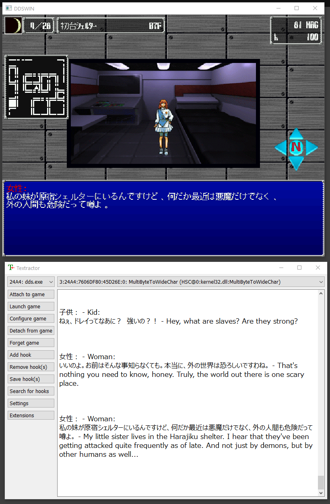
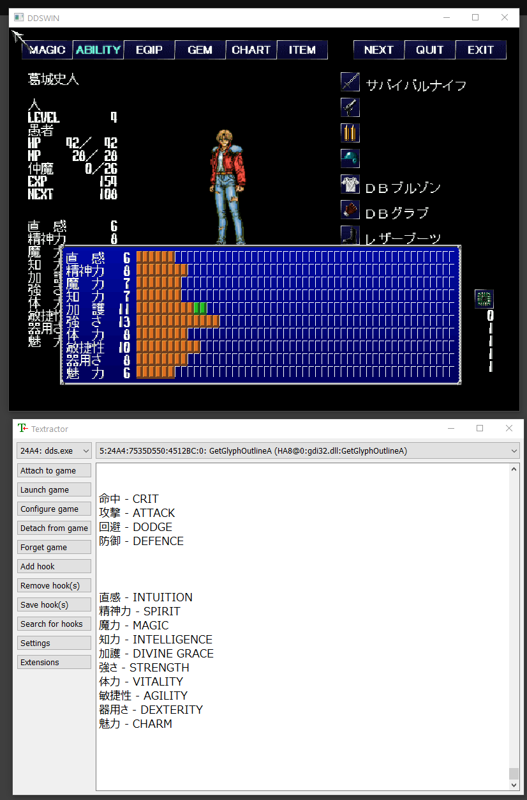
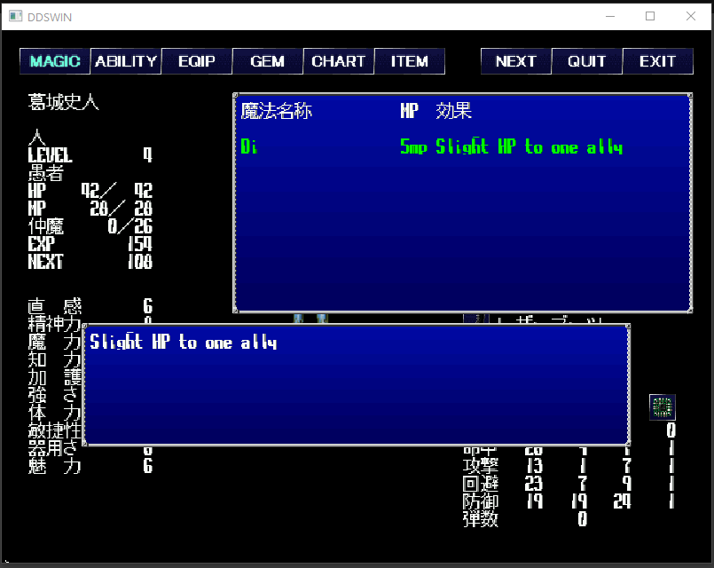

# giten-translation
Ongoing translation project for the 1997 PC game, Giten Megami Tensei: Tokyo Mokushiroku.

This project uses the powerful DLL-hooking tool Textractor to capture messages displayed by the game in real-time, and then translates them via a custom lookup table. While Textractor is most know for its applications in machine translation, none of those features are being used here; all of the translation work has been done by hand.

Furthermore, certain pieces of text have been patched in order to be displayed natively in the game. For now, this only means skill names/description, but in the future, will hopefully be expanded to include other things as well, such as items and demon names.

Please keep in mind that this project is still very early on. Nothing past the prologue has been translated, and even the parts that are might be missing small bits. Everything you see here is subject to change, so if you have any feedback/suggestions, feel free to let me know.

## Installation
1. [Install the latest build of Textractor (x86)](https://github.com/Artikash/Textractor/tree/master/extensions)
2. [Download Giten (CPU patch highly recommended for playing on modern devices)](https://japanesepccompendium.blogspot.com/2013/10/giten-megami-tensei-tokyo-mokushiroku.html?m=1)
3. Place the contents of Extension folder in the same directory as Textractor. Open Textractor, click on "Extensions", and delete all of the default ones the program comes with (although you might want to keep "Remove Repeated Phrases" as it makes ). After that, right click -> "Add extension" -> select "GitenTranslator.dll".
4. Launch the game, then switch back to Textractor and click on "Attach to game". Find "dds.exe" in the list and select it. Finally, after all of the hooks have been loaded, choose either "MultiByteToWideChar" or "GetStringTypeW" from the dropdown menu above the text display.

## Frequently Asked Questions
**System text isn't showing up in Textractor**

Please change the hooking mode to GetGlyphOutlineA. 

**I found untranslated text**

Please submit a ticket and I'll get it fixed as soon as possible. Make sure to include the output copied from Textractor alongside a screenshot, and potentially a save if you have one near where the text appeared.

**Why isn't this a proper patch?**

While that was my original goal with the project, Giten turned out to be way more difficult to hack than I at first anticipated. Specifically, the dialogue for conversations appears to be using some sort of a strange compression system that I can't quite figure out. Other than that, the game does display English perfectly, so if anyone wants to offer me help on the technical side, it should be possible.

## Screenshots

